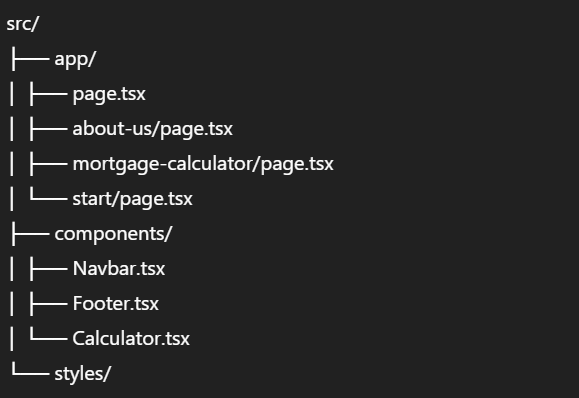

---

## 🔗 Live Demo Result


- [Home](https://better-clone-theta.vercel.app/)
- [About-us](https://better-clone-theta.vercel.app/about-us)
- [Mortgage Calculator](https://better-clone-theta.vercel.app/mortagecalculator)
- [Start Page](https://better-clone-theta.vercel.app/start)
---
# 🏠 Better.com Clone – React + Next.js (Internship Assignment for The Medius)

> ✅ This project is a **complete solution** to the assignment given for the **React Intern Role** at **The Medius**.  
> It fulfills all the listed requirements including routing, responsive design, mortgage calculator functionality, and deployment.

---

## 📄 Assignment Overview (Provided by The Medius)

As part of the React Intern selection process, we were asked to replicate 4 key pages from the Better.com website using React + Next.js. Below is a mapping of original requirements to the final implemented output:

| Page Type           | Original Page                                                                 | ✅ Implemented Page (Answer)                                                   |
|---------------------|-------------------------------------------------------------------------------|--------------------------------------------------------------------------------|
| Home                | [better.com](https://better.com)                                              | [Home Page](https://better-clone-theta.vercel.app/)                           |
| About Us            | [better.com/about-us](https://better.com/about-us/)                          | [About Us](https://better-clone-theta.vercel.app/about-us)                    |
| Mortgage Calculator | [better.com/mortgage-calculator?taxes=265&zip=421005](https://better.com/mortgage-calculator?taxes=265&zip=421005) | [Mortgage Calculator](https://better-clone-theta.vercel.app/mortagecalculator) |
| Start Page          | [better.com/start](https://better.com/start)                                  | [Start Page](https://better-clone-theta.vercel.app/start)                     |

---

## 🚀 Project Features

✅ Built with **Next.js App Router**  
✅ Fully responsive on all screen sizes  
✅ Accurate **Mortgage Calculator logic**  
✅ Modern UI closely styled like Better.com using **Tailwind CSS**  
✅ Routing and Navigation for all 4 pages  
✅ Clean component-based architecture  
✅ Deployed on **Vercel**

---

## 🧠 Tech Stack

- React 18  
- Next.js 14 (App Router)  
- TypeScript  
- Tailwind CSS  
- Vercel (Deployment)

---

## 📁 Folder Structure



---

## 📦 Getting Started Locally

```bash
# Clone the repo
git clone https://github.com/tushartalmale/better-clone.git
cd better-clone

# Install dependencies
npm install

# Start development server
npm run dev

# Build for production
npm run build
npm start
